# VLSI-Based Digital Clock with Alarm Functionality

A complete RTL-to-FPGA digital clock and alarm system built in Verilog, targeting the Xilinx Artix-7 (Basys3) FPGA board. This project implements a 24-hour real-time clock with seconds/minutes/hours counters, a programmable alarm comparator, and a multiplexed seven-segment display driver — all verified through simulation with a self-checking testbench.

---

## Overview

A digital clock is one of the most classic and widely used real-time systems in electronics — found in watches, microwave ovens, embedded controllers, and industrial timers. This project recreates that system entirely in synthesizable RTL, demonstrating core VLSI/digital design skills: clock division, modular counter design, comparator logic, BCD conversion, and time-division multiplexing for display output.

The design counts real time in 24-hour format (00:00:00 to 23:59:59), lets the user program an alarm time and arm/disarm it via a switch, and fires an alarm signal the instant the current time matches the programmed alarm time.

## Problem Statement

Digital systems need a reliable, hardware-efficient way to track and display real time, and to trigger events at user-specified times. Building this from scratch in RTL (rather than using a microcontroller's built-in RTC) demonstrates how real-time clock ICs, embedded timers, and FPGA-based control systems work at the hardware level — knowledge that's directly transferable to digital design, ASIC, and FPGA engineering roles.

## VLSI / Digital Design Concepts Used

| Concept | Where it's used |
|---|---|
| Clock division | `clock_divider.v` — converts 100 MHz board clock into a 1 Hz tick |
| Modulo counters | `seconds_counter.v`, `minutes_counter.v` (mod-60), `hours_counter.v` (mod-24) |
| Synchronous reset | Every module — single active-high `rst` |
| Comparator logic | `alarm_comparator.v` — compares live time against programmed alarm time |
| Binary-to-BCD conversion | `bin_to_bcd.v` — splits binary values into decimal digits for display |
| Seven-segment decoding | `seven_seg_decoder.v` — BCD digit to segment pattern |
| Time-division multiplexing | `display_mux.v` — drives 4 shared seven-seg digits with few pins |
| Parameterized modules | `CLK_DIVISOR` parameter allows fast simulation vs. real 100 MHz hardware |
| Self-checking testbench | `tb_digital_clock_alarm_top.v` — automated PASS/FAIL verification |

## Architecture

```
        clk (100 MHz)
            |
            v
   clock_divider --tick_1hz (1 pulse/sec)--> seconds_counter (0-59)
                                                    |
                                              rollover (every 60s)
                                                    v
                                              minutes_counter (0-59)
                                                    |
                                              rollover (every 60m)
                                                    v
                                              hours_counter (0-23)
                                                    |
        hours, minutes, seconds ---------------------+
                                                       v
        alarm_hour_in, alarm_min_in, alarm_enable --> alarm_comparator --> alarm_led
                                                       |
                                              bin_to_bcd (minutes + seconds)
                                                       |
                                              display_mux --> anode[3:0]
                                                       |
                                              seven_seg_decoder --> seg[6:0]
```

**Display behavior:** the 4 onboard seven-segment digits show **MM:SS** (minutes:seconds). Current hour is exposed as a top-level output (`hours_out`) for simulation, debugging, and can be wired to extra LEDs or an additional display module.

### Alarm Comparison Table

| Current Time | Alarm Time | alarm_enable | alarm_led |
|---|---|---|---|
| 07:30:00 | 07:30 | 1 | **1 (fires)** |
| 07:30:00 | 07:30 | 0 | 0 (disabled) |
| 07:29:00 | 07:30 | 1 | 0 (no match yet) |
| 08:00:00 | 07:30 | 1 | 0 (already passed) |

## Tools Used

- **HDL:** Verilog-2001
- **Simulation:** Icarus Verilog (`iverilog` / `vvp`) for fast iterative testing; Xilinx Vivado 2024.2 simulator for the official FPGA-flow waveform
- **Synthesis / Implementation:** Xilinx Vivado 2024.2
- **Target Board:** Digilent Basys3 (Xilinx Artix-7 XC7A35T-1CPG236C)
- **Waveform Viewer:** GTKWave / Vivado Waveform Viewer

## Folder Structure

```
VLSI-Digital-Clock-Alarm/
├── rtl/                  # Synthesizable Verilog source modules
├── tb/                   # Testbenches (full verification + waveform demo)
├── constraints/          # Basys3 XDC pin constraints
├── simulation/           # Simulation run logs (proof of passing tests)
├── waveforms/            # Saved .vcd waveform for documentation
├── reports/              # Project report, synthesis/utilization notes
├── images/               # Screenshots (RTL, waveforms, Vivado reports)
├── docs/                 # Extended write-ups (concepts, interview prep, GitHub strategy)
├── README.md
└── .gitignore
```

## How to Simulate

### Option 1 — Xilinx Vivado 2024.2
1. Create a new RTL project, add all files from `rtl/` as design sources.
2. Add `tb/tb_digital_clock_alarm_top.v` as a simulation-only source.
3. Add `constraints/basys3_constraints.xdc` as a constraints file (for implementation only — not needed for simulation).
4. Run **Behavioral Simulation**, then type `run -all` in the Tcl console (Vivado's default run length is too short to reach `$finish` — see [`docs/simulation_guide.md`](docs/simulation_guide.md) for why this matters).
5. Watch the Tcl console for the `[PASS]`/`[FAIL]` log and the final `ALL TESTS PASSED` summary.
6. Run **Synthesis → Implementation → Generate Bitstream** to target real Basys3 hardware.

### Option 2 — Icarus Verilog (fast, no Vivado install needed)
```bash
cd VLSI-Digital-Clock-Alarm
iverilog -g2005 -o sim_out tb/tb_digital_clock_alarm_top.v rtl/*.v
vvp sim_out
```
Expected output: `17 checks run, 0 failures — RESULT: ALL TESTS PASSED`

To generate a small waveform file for viewing in GTKWave:
```bash
iverilog -o demo_out tb/tb_waveform_demo.v rtl/*.v
vvp demo_out
gtkwave waveforms/demo_waveform.vcd
```

See [`docs/simulation_guide.md`](docs/simulation_guide.md) and [`docs/fpga_implementation_guide.md`](docs/fpga_implementation_guide.md) for detailed step-by-step instructions.

## Sample Waveform

A short demo waveform (`waveforms/demo_waveform.vcd`) shows: reset, seconds incrementing, the seconds-to-minutes rollover, and the alarm firing at the programmed time.

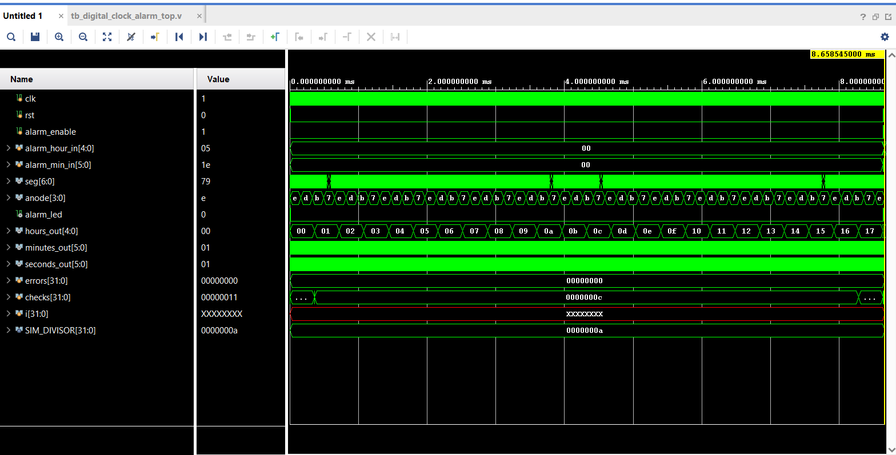
*Vivado XSim waveform: `hours_out`/`minutes_out`/`seconds_out` counting, `seg`/`anode` multiplexing, and `checks`/`errors` confirming 0 failures live during the run.*

## Verification Summary

| Test | Result |
|---|---|
| Reset clears all counters and alarm | PASS |
| Seconds increment correctly | PASS |
| Seconds rollover (59→0) increments minutes | PASS |
| Minutes rollover (59→0) increments hours | PASS |
| Hours rollover at midnight (23→0) | PASS |
| Alarm fires on time match + enabled | PASS |
| Alarm stays silent when disabled | PASS |
| Alarm stays silent on time mismatch | PASS |

**17/17 automated checks passed** — verified in both Icarus Verilog and Vivado 2024.2 (XSim). Full log: [`simulation/simulation_log.txt`](simulation/simulation_log.txt)

## FPGA Build Results (Vivado 2024.2, Artix-7 xc7a35tcpg236-1)

| Stage | Result |
|---|---|
| Behavioral Simulation | PASS (17/17 checks) |
| Synthesis | Clean, no errors |
| Implementation | Clean, no errors |
| Bitstream Generation | Successful |

**Post-implementation (post-route) results — the authoritative, final numbers:**

| Metric | Value |
|---|---|
| Timing (100 MHz constraint) | 0 failing endpoints, WNS 5.468 ns, WHS 0.165 ns |
| Resource Utilization | 52 LUTs, 64 registers, 31 slices (<1% of device) |
| Total On-Chip Power | 0.084 W (88% device static, 12% dynamic) |

These come from the **implemented design's** own reports (Timing/Utilization/Power, opened after Run Implementation completed) — not the earlier synthesis-stage estimates. Worth noting: the post-route timing slack actually came out slightly *better* than the synthesis estimate (WNS 5.468 ns vs. 5.285 ns), and utilization/power held exactly steady, confirming the design's small size leaves comfortable margin at every stage.

<details>
<summary>Post-synthesis estimates (pre-route, for comparison)</summary>

| Metric | Value |
|---|---|
| Timing (100 MHz constraint) | 0 failing endpoints, WNS 5.285 ns, WHS 0.147 ns |
| Resource Utilization | 52 LUTs, 64 registers (<1% of device) |
| Total On-Chip Power | 0.084 W |

</details>

Full numbers and a note on the one real DRC issue hit along the way (and its fix) are in [`reports/project_report.md`](reports/project_report.md).

### Screenshots

**Post-synthesis (pre-route estimates):**

| Synthesized Device | Synthesized Schematic |
|---|---|
| 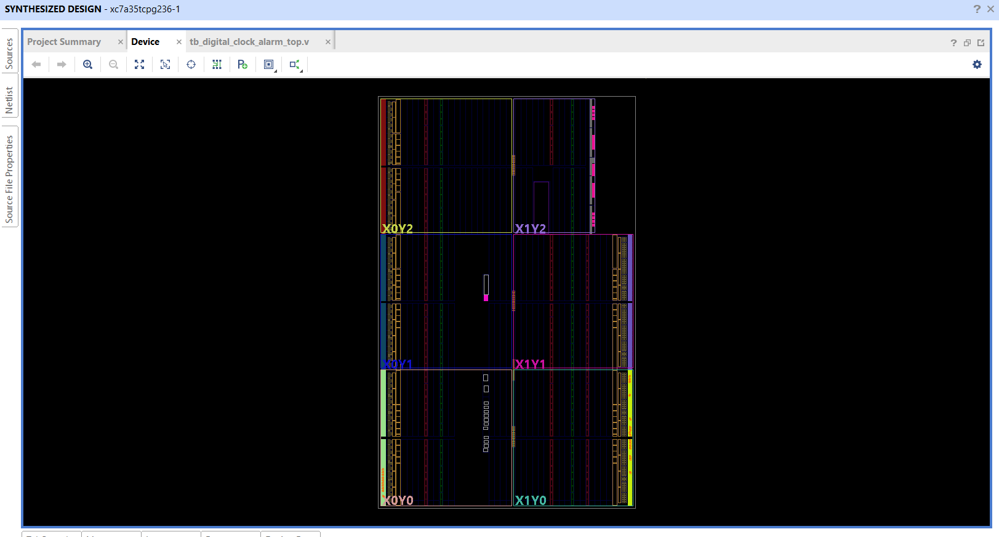 | 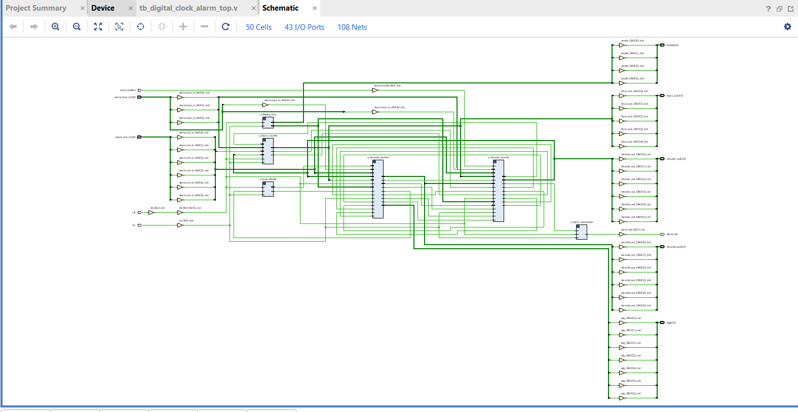 |

| Utilization Report | Timing Summary |
|---|---|
| 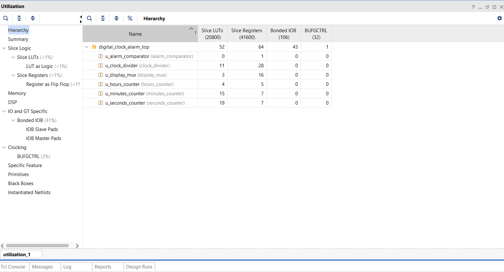 | 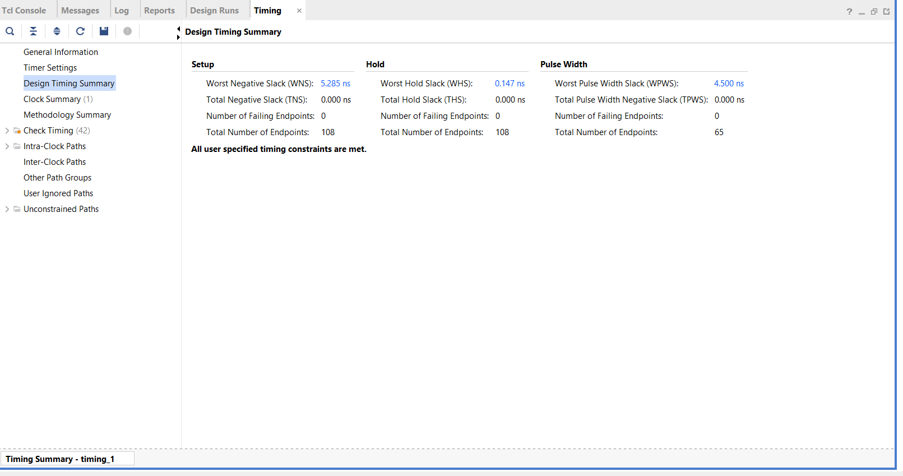 |

| Power Report |
|---|
| 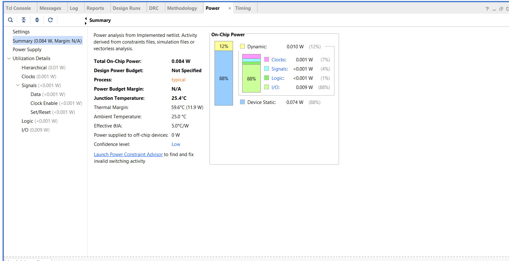 |

**Post-implementation (post-route — authoritative, final results):**

| Implemented Device (placed & routed) | Implemented Schematic |
|---|---|
| 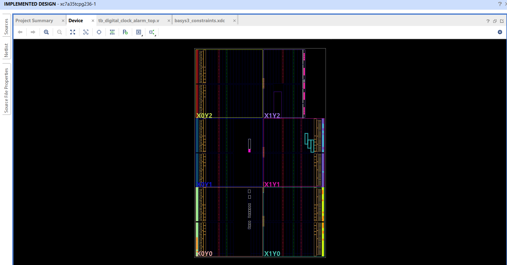 | 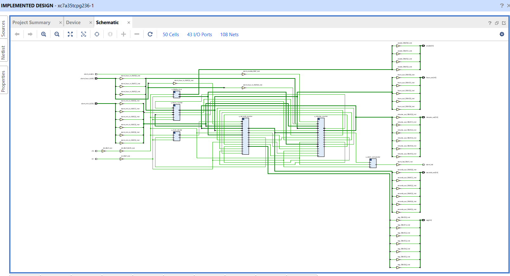 |

| Timing Summary | Utilization Report |
|---|---|
| 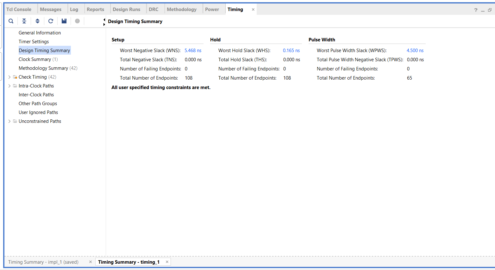 | 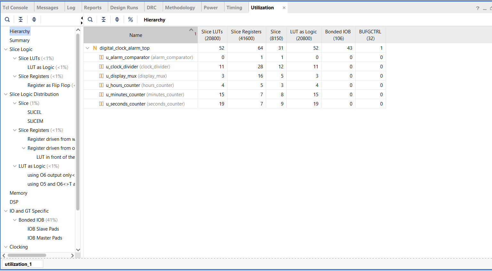 |

| Power Report |
|---|
| 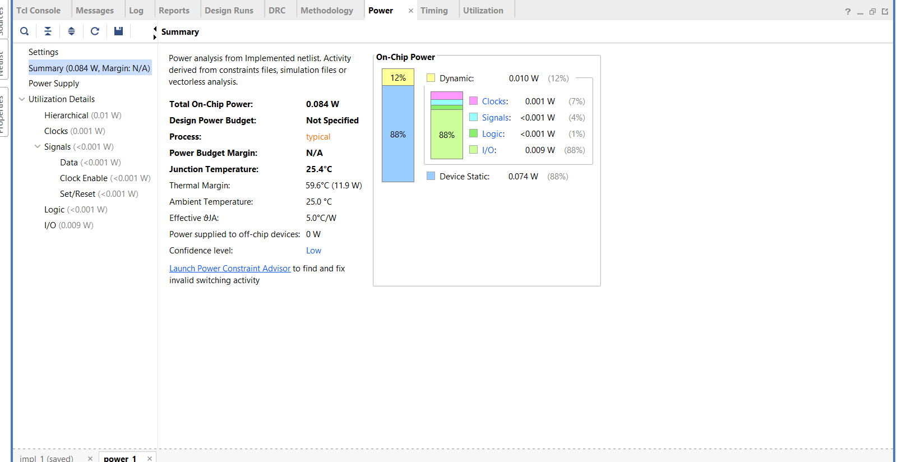 |

## Future Improvements

- Button-based time and alarm setting (instead of switches only)
- Snooze functionality
- 12-hour/24-hour display mode toggle
- Buzzer output via PWM tone generator
- Hours display on a second seven-segment bank or 4-digit time-multiplexed HH:MM:SS cycling
- UART interface to set time from a PC

## Learning Outcomes

- Designed and connected multiple synchronous RTL modules into a complete system
- Applied clock-division techniques to generate slower timing references from a fast system clock
- Built modulo-N counters with proper rollover/carry propagation
- Implemented comparator-based event logic (the same pattern used in RTC alarm ICs)
- Practiced binary-to-BCD conversion and seven-segment decoding
- Used time-division multiplexing to drive a multi-digit display with limited I/O pins
- Wrote a self-checking testbench and debugged real register-latency timing issues during verification
- Took a design through the full RTL → simulation → synthesis → FPGA implementation flow

## Author

**Seshuu** — VLSI Course Project

## 🤝 Connect With Me

* **GitHub:** [github.com/YOUR_USERNAME](https://github.com/Seshu-Konijeti)
* **LinkedIn:** [linkedin.com/in/YOUR_LINKEDIN_ID](https://www.linkedin.com/in/seshu-babu-konijeti-74968b2b9?utm_source=share_via&utm_content=profile&utm_medium=member_android)
